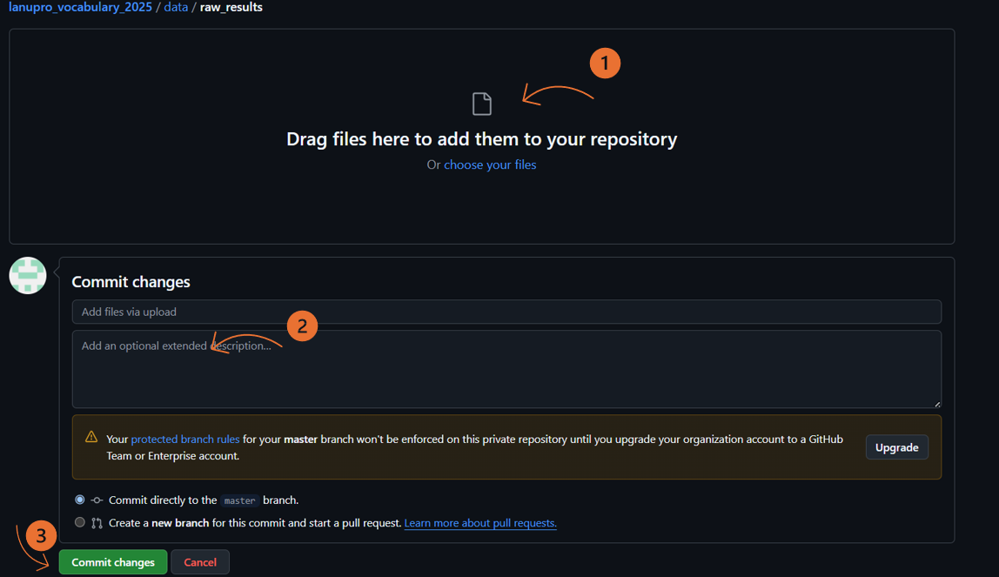
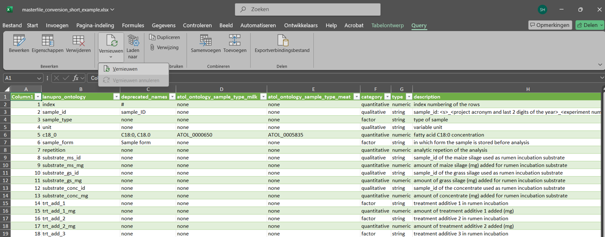

# lanupro-vocabulary

Welcome to the **lanupro vocabulary** repository! This project hosts lanupro naming conventions used in lab data templates.

Excel masterfile lab templates are linked via Power Query for streamlined integration of the existing naming conventions.

## Getting Started

### Using the naming conventions

The naming conventions are integrated in the lanupro lab templates. Just use the lab templates for your data.

### Changing the naming conventions

*If a name is not present in the Lanupro lab template, you have to update the lanupro_vocabulary*

1.  Choose the right vocabulary file depending on your analysis and download the excel file from github:

| Download | Preview |
|------------------------------------|------------------------------------|
| [lanupro_vocabulary_general](https://github.com/lanupro-analytics/lanupro_vocabulary_2025/raw/refs/heads/master/data/raw_results/lanupro_vocabulary_general.xlsx) | [lanupro_vocabulary_general](https://github.com/lanupro-analytics/lanupro_vocabulary_2025/blob/master/data/processed/lanupro_vocabulary_general.csv) |
| [lanupro_vocabulary_fatty_acids](https://github.com/lanupro-analytics/lanupro_vocabulary_2025/raw/refs/heads/master/data/raw_results/lanupro_vocabulary_fatty_acids.xlsx) | [lanupro_vocabulary_fatty_acids](https://github.com/lanupro-analytics/lanupro_vocabulary_2025/blob/master/data/processed/lanupro_vocabulary_fatty_acids.csv) |
| [lanupro_vocabulary_incbuations](https://github.com/lanupro-analytics/lanupro_vocabulary_2025/raw/refs/heads/master/data/raw_results/masterfile_incubations.xlsx) | [lanupro_vocabulary_incubations](https://github.com/lanupro-analytics/lanupro_vocabulary_2025/blob/master/data/processed/lanupro_vocabulary_incubations.csv) |

2.  Edit locally: add your new names

3.  Upload the file on:\
    <https://github.com/lanupro-analytics/lanupro_vocabulary_2025/upload/master/data/raw_results>

    Drag of choose the file, add an optional message and press "Commit"

    

4.  Refresh the power query of your lab file to import the latest naming conventions: ready for use!

    

### Contribute to the coding

Only required when you want to actively contribute to the coding, not for the names in excel format

-   R (version 4.0 or higher recommended)\
-   RStudio\
-   Git\
-   Access to the `lanupro` GitHub organization\
-   Power Query-compatible software (e.g., Microsoft Excel)

How to contribute:

1.  Fork the repo

2.  Make a branch (e.g. feature/my-fix)

3.  Open a Pull Request back to themain branch
